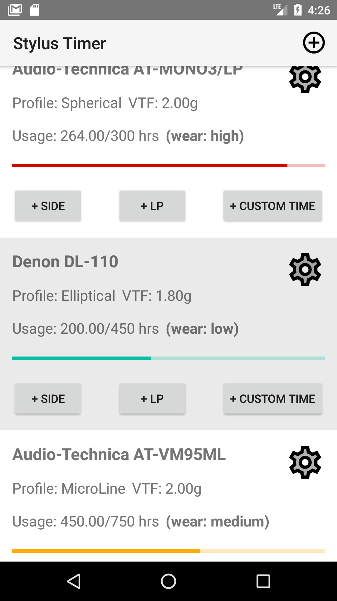

# Stylus Timer

&copy; 2023 Pavel Urusov. See LICENSE.txt for details.

This application was created as the final project for DCU's SDA (Mobile Application Development) module. It is used to track the amount of wear of a turntable stylus.

Requires Android 7.0 (API level 24) or later.

## Application launch flow

## Adding a stylus flow

## Screenshots

The turntable icon used for the app is in the public domain: https://creazilla.com/nodes/3153218-phonograph-record-clipart 
